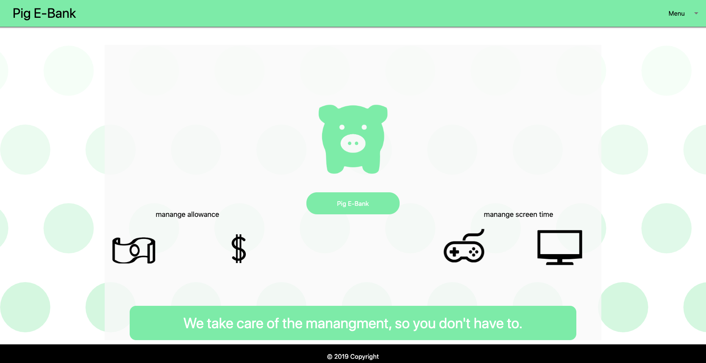

### Pig E-Bank

​
## Installation:
View website: https://ajrsabet.github.io/Screen_Time_Tracker/
​
Github link: https://github.com/ajrsabet/Screen_Time_Tracker

## Usage:

This website allows the parent to be able to keep track of the kid’s electronic device usage and their allowance. To use the website, the user first comes to the home page and car either select one of the kid’s profiles, or to manage the kid profiles through the parent portal. To access the pages the user can use the dropdown at the top corner of the page, or click on the floating circles to change to the corresponding profile.

## Parent Portal:

-The parent can manage the kid profiles through the parent index. 
.Pressing the kid circles will take the parent to the corresponding profile. 
.The plus and minus buttons will add or subtract the time from the profiles.
.Below is the viewport to see what the saved screen time and how much money is left in their account.
.Lastly is the chart, which shows the amount the kids had withdrawn over the week.

## Kid page:

This would be where the kids would be able to see their profile and style their page with the “edit profile” button located on the top right corner of the screen.  On their page, they can either withdraw money, or press the play button to start the timer countdown.  Both values are equal to each-other, so the kid can pick which of the two they want to use. 

## Edit page:

This is where the kid would be able to go into their profile and customize their background image, name, and style color to save to their profile.

​
## Credits:

Alexa Anthony - Front-end
Lian Hayes - Back-end
Adam Sabet - Back-end
Aidan Willett - Front-end
​
## ​Third-party assets:

- Data Charts: Chart.js - https://www.chartjs.org/
- Time: Moment.js - https://momentjs.com/
- CSS: Materialize - https://materializecss.com/getting-started.html

## Server-Side: 

- Photos: Unsplash - https://unsplash.com/ 
- Video: YouTube API - https://developers.google.com/youtube/v3
- https://www.w3schools.com/ for help with styling
- https://stackoverflow.com/ for help with syntax

## License
N/A

## Badges
N/A

## Contributing
N/A

## Tests
N/A
